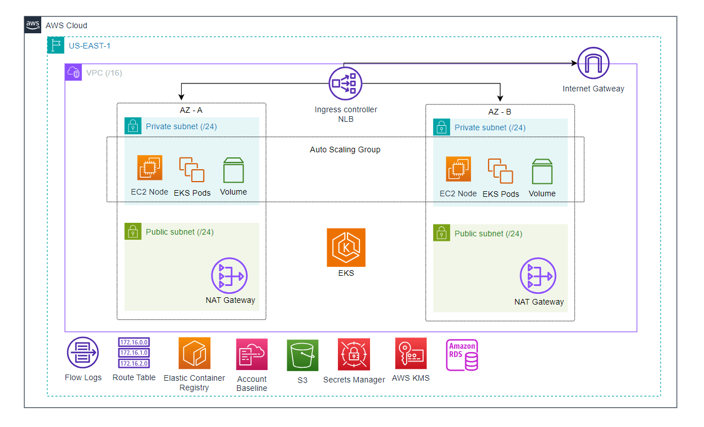

# Terraform EKS Cluster

Este projeto provisiona um cluster Amazon EKS (Elastic Kubernetes Service) na AWS utilizando Terraform. A infraestrutura é projetada para ser robusta, escalável e otimizada em custos, utilizando componentes modernos como o Karpenter para o auto-scaling de nós.

## Arquitetura

A arquitetura consiste nos seguintes componentes principais:

*   **VPC:** Uma nova VPC é criada com sub-redes públicas e privadas distribuídas em duas zonas de disponibilidade para alta disponibilidade.
*   **EKS Control Plane:** O cérebro do cluster Kubernetes, gerenciado pela AWS.
*   **EKS Managed Node Group:** Um grupo de nós gerenciado inicial, ideal para executar componentes essenciais do sistema.
*   **Karpenter:** Um provisionador de nós open-source e flexível que lança novas instâncias EC2 de forma rápida e eficiente em resposta à demanda de pods não agendados.
*   **Add-ons Essenciais:**
    *   **NGINX Ingress Controller:** Para gerenciar o acesso externo aos serviços no cluster, configurado com um Network Load Balancer (NLB).
    *   **Secrets Store CSI Driver:** Para montar secrets do AWS Secrets Manager diretamente como arquivos em pods do Kubernetes, de forma segura.



---

## Pré-requisitos

Antes de começar, você precisará ter o seguinte instalado e configurado:

1.  **Terraform:** Versão `~> 1.5`.
2.  **AWS CLI:** Versão `~> 2.0`.
3.  **Credenciais AWS:** Configure suas credenciais de acesso à AWS (e.g., via `~/.aws/credentials` ou variáveis de ambiente).
4.  **Bucket S3 para Backend:** Um bucket S3 para armazenar o estado do Terraform (`.tfstate`).

## Como Usar

### 1. Configuração do Backend

O backend para o estado do Terraform está configurado em `provider.tf`. Certifique-se de que o nome do bucket (`bucket`) corresponde ao bucket que você criou.

```terraform
// provider.tf

terraform {
  backend "s3" {
    bucket = "tf-state-777" // <- Altere para o seu bucket
    key    = "app-eks/terraform.tfstate"
    region = "us-east-1"
  }
}
```

### 2. Configuração de Variáveis

Crie um arquivo `terraform.tfvars` na raiz do projeto para definir as variáveis necessárias.

```hcl
// terraform.tfvars

project_name = "meu-projeto"
cluster_name = "meu-cluster-eks"
cidr_block   = "10.0.0.0/16"
aws_account_id = "123456789012" // <- Seu Account ID da AWS
```

### 3. Executando o Terraform

Execute os seguintes comandos para provisionar a infraestrutura:

```bash
# 1. Inicializar o Terraform
terraform init

# 2. Planejar as mudanças
terraform plan -out=tfplan

# 3. Aplicar as mudanças
terraform apply "tfplan"
```

### 4. Acessando o Cluster

Após a aplicação, configure seu `kubectl` para se conectar ao novo cluster EKS:

```bash
aws eks update-kubeconfig --region us-east-1 --name <nome-do-cluster>
```

Substitua `<nome-do-cluster>` pelo valor da variável `cluster_name`.

## Pipeline de CI/CD (GitLab)

O projeto inclui um arquivo `.gitlab-ci.yml` para automação de `plan`, `apply` e `destroy` usando o GitLab CI/CD.

*   **`plan`:** É executado automaticamente em cada push para a branch `main`. Ele gera um plano do Terraform e o salva como um artefato.
*   **`apply`:** É um job manual. Ele aplica o plano gerado na etapa de `plan`.
*   **`destroy`:** É um job manual que destrói toda a infraestrutura gerenciada pelo Terraform.

Para que a pipeline funcione, as seguintes variáveis de CI/CD precisam ser configuradas no seu projeto GitLab:
*   `AWS_ACCESS_KEY_ID`
*   `AWS_SECRET_ACCESS_KEY`
*   `AWS_ACCOUNT_ID`
*   `CIDR_BLOCK`
*   `PROJECT_NAME`
*   `CLUSTER_NAME`

<!-- BEGIN_TF_DOCS -->
## Requirements

| Name | Version |
|------|---------|
| <a name="requirement_aws"></a> aws | ~> 5.0 |
| <a name="requirement_helm"></a> helm | ~> 2.0 |
| <a name="requirement_kubectl"></a> kubectl | >= 1.14 |
| <a name="requirement_kubernetes"></a> kubernetes | ~> 2.0 |

## Modules

| Name | Source | Version |
|------|--------|---------|
| <a name="module_eks_cluster"></a> eks\_cluster | ./modules/cluster | n/a |
| <a name="module_eks_managed_node_group"></a> eks\_managed\_node\_group | ./modules/managed-node-group | n/a |
| <a name="module_eks_network"></a> eks\_network | ./modules/network | n/a |
| <a name="module_karpenter"></a> karpenter | terraform-aws-modules/eks/aws//modules/karpenter | n/a |
| <a name="module_secret_manager"></a> secret\_manager | ./modules/secrets | n/a |

## Inputs

| Name | Description | Type | Default | Required |
|------|-------------|------|---------|:--------:|
| <a name="input_aws_account_id"></a> aws\_account\_id | AWS Account ID where the resources will be created. | `string` | n/a | yes |
| <a name="input_aws_partition"></a> aws\_partition | AWS partition (e.g., "aws", "aws-cn"). | `string` | `"aws"` | no |
| <a name="input_cidr_block"></a> cidr\_block | Network CIDR block to be used for the VPC. | `string` | n/a | yes |
| <a name="input_cluster_name"></a> cluster\_name | The name of the EKS cluster. | `string` | n/a | yes |
| <a name="input_project_name"></a> project\_name | Project name to be used to name the resources (Name tag). | `string` | n/a | yes |

## Outputs

No outputs.
<!-- END_TF_DOCS -->